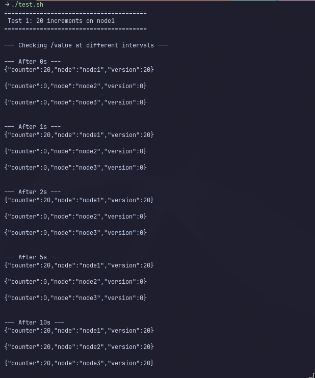
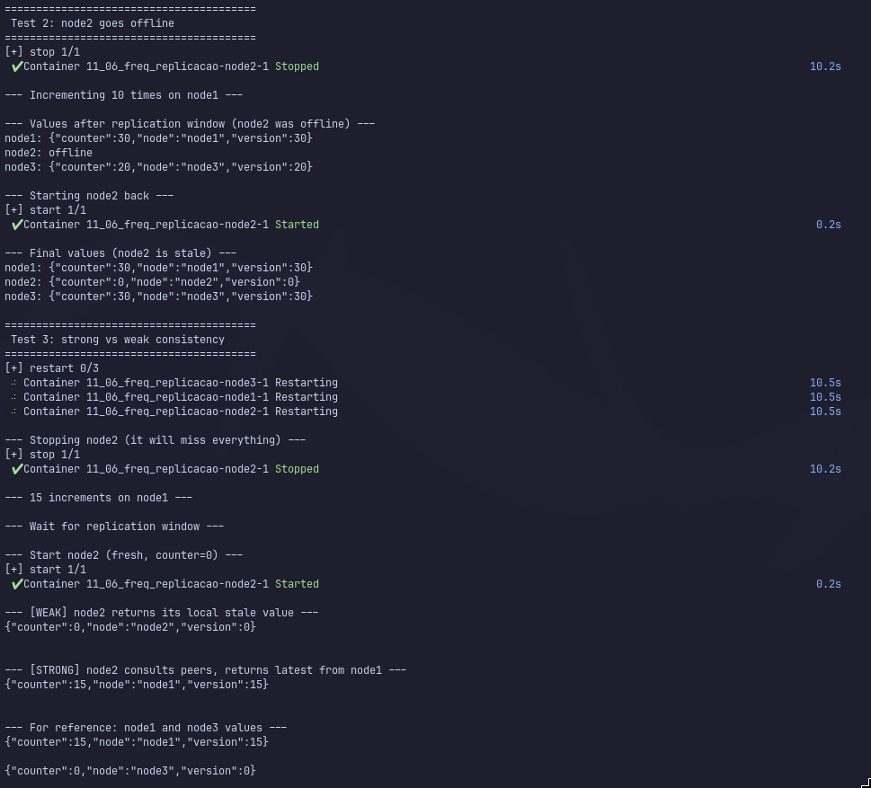

# Sistema de Réplica com Consistência Fraca e Forte

## Visão Geral

Grupo H, Delay = 9 segundos

Sistema distribuído composto por 3 nós Flask, cada um mantendo as variáveis `counter` e `version` em memória. A replicação entre os nós é assíncrona, com um intervalo arbitrário antes de propagar o estado para os demais nós (modelo _push-only_).

## Componentes

| Componente                      | Descrição                                      |
| ------------------------------- | ---------------------------------------------- |
| **node1**, **node2**, **node3** | Servidores Flask com estado em memória         |
| **Docker Compose**              | Orquestração dos 3 contêineres em rede interna |
| **test.sh**                     | Script de teste automatizado                   |

## API

| Método | Rota                        | Descrição                                                                   |
| ------ | --------------------------- | --------------------------------------------------------------------------- |
| `POST` | `/increment`                | Incrementa `counter` e `version` em 1; agenda replicação para 9s depois     |
| `GET`  | `/value`                    | Retorna o estado local do nó (consistência fraca)                           |
| `GET`  | `/value?consistency=strong` | Consulta todos os peers e retorna o de maior `version` (consistência forte) |
| `POST` | `/replicate`                | Endpoint interno para receber replicação dos peers                          |

### Formato de resposta (`/value`)

```json
{ "counter": 10, "version": 10, "node": "node1" }
```

O campo `node` indica qual nó originou os dados retornados.

## Critérios de Replicação

- **Assíncrona**: a resposta do `POST /increment` é imediata; a replicação para os peers ocorre 9 segundos depois, em uma _thread_ separada.
- **Push-only**: cada requisição de incremento dispara um `threading.Timer` de 9 segundos, que envia o estado **atual** do nó a todos os seus peers.
- **Baseada em versão**: ao receber uma replicação, o nó só atualiza seu estado se a `version` recebida for **maior** que a local. Isso evita regressão do estado.
- **Sem re-réplica**: quando um nó recebe uma replicação (`POST /replicate`), ele atualiza seu estado mas **não** repassa a atualização adiante. Apenas o nó que recebeu o `POST /increment` original dispara replicações.

## Consistência Fraca vs Forte

| Característica  | Fraca (padrão)                    | Forte (`?consistency=strong`)            |
| --------------- | --------------------------------- | ---------------------------------------- |
| O que retorna   | Valor local do nó consultado      | Maior `version` entre todos os peers     |
| Latência        | Imediata (memória local)          | Consulta todos os peers (mais lento)     |
| Staleness       | Pode estar desatualizado (até 9s) | Sempre o mais recente disponível na rede |
| Disponibilidade | Funciona mesmo com peers offline  | Requer ao menos um peer online           |

## Limitações

Por ser _push-only_, um nó que fica offline durante a janela de replicação de 9 segundos **não** recebe as atualizações que ocorreram nesse período. Ao voltar, seu estado local fica desatualizado até que um novo incremento ocorra e replique para ele. Uma abordagem _pull_ na inicialização resolveria esse problema, mas foi omitida propositalmente para demonstrar o comportamento do modelo.

## Como executar

```bash
# Constrói as imagens e sobe os contêineres
docker compose up --build -d

# Executa a suíte de testes
./test.sh
```

## Testes

O script `test.sh` executa três cenários:

### Teste 1: **20 incrementos no node1**

Mostra a evolução temporal da replicação: nos instantes 0s, 1s, 2s, 5s e 10s.
A cada momento, exibe o estado de todos os nós para observar a convergência após os 9 segundos.

### Teste 2: **node2 offline**

Derruba o node2, faz 10 incrementos no node1, espera a janela de replicação, religa o node2 e exibe os valores.
Demonstra que o node2 ficou desatualizado (limitacão do modelo push-only).

### Teste 3: **Consistência fraca vs forte**

Derruba o node2 antes de qualquer incremento, faz 15 incrementos no node1, espera a janela de replicação, religa o node2 e compara os modos fraco (`/value`) e forte (`/value?consistency=strong`).

## Resultados



